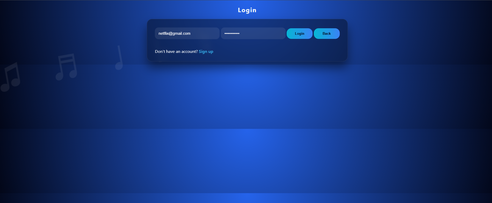
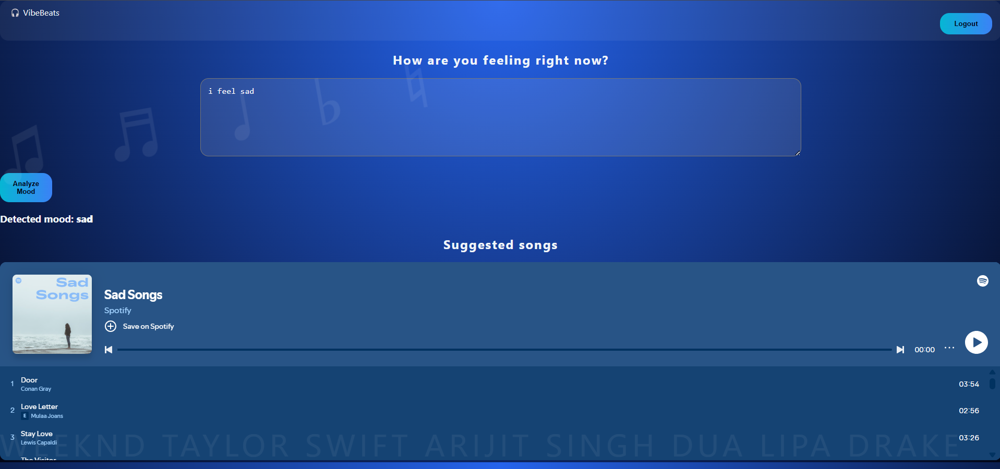
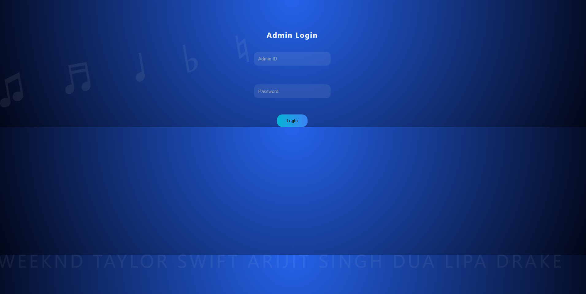
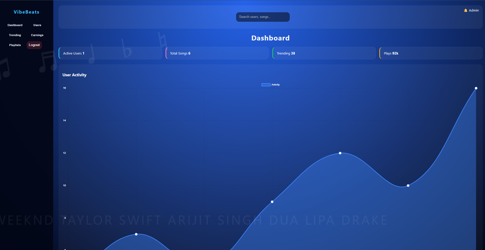
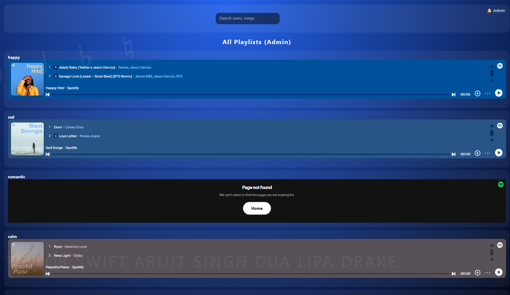

# 🎵 VibeBeats

An AI-powered mood-based music recommendation web application that analyzes a user's emotions from text input and recommends Spotify playlists that match their mood.

---

## 🚀 Features

- 🔐 User Authentication (Login & Signup)
- 👤 Guest Mode
- 😊 Mood Detection from user text
- 🎧 Spotify Playlist Recommendations
- 💾 MongoDB Database Integration
- 🛠️ Admin Dashboard
- 📋 Playlist Management
- 📱 Responsive User Interface

---

## 🛠️ Tech Stack

### Frontend

- HTML5
- CSS3
- JavaScript

### Backend

- Node.js
- Express.js

### Database

- MongoDB
- Mongoose

### APIs & Services

- Spotify Embed Playlists

---

## 📂 Project Structure

```text
VibeBeats
│
├── backend
│   ├── models
│   ├── routes
│   ├── server.js
│   └── seedSongs.js
│
├── frontend
│   ├── index.html
│   ├── dashboard.html
│   ├── login.html
│   ├── signup.html
│   ├── adminDashboard.html
│   ├── dashboard.js
│   └── style.css
│
├── screenshots
├── README.md
└── package.json
```

---

## 📸 Screenshots

### Dashboard



### Mood Detection



### Admin Login



### Admin Dashboard



### Admin Dashboard2



---

## ⚙️ Installation

### 1. Clone the Repository

```bash
git clone https://github.com/Thanushri25/vibe-beats.git
cd vibe-beats
```

### 2. Install Dependencies

```bash
cd backend
npm install
```

### 3. Configure Environment Variables

Create a `.env` file inside the `backend` folder:

```env
PORT=5000
MONGO_URI=your_mongodb_connection_string
```

### 4. Start the Backend

```bash
node server.js
```

### 5. Run the Frontend

Open `frontend/index.html` using **Live Server**.

---

## 🔄 Workflow

1. User logs in or signs up.
2. User enters their current mood.
3. The backend analyzes the emotion.
4. A matching playlist is retrieved from MongoDB.
5. The Spotify playlist is embedded and displayed to the user.

---

## 🌱 Future Enhancements

- ❤️ Favorite Playlists
- 📈 Mood History Tracking
- 🎵 Personalized Recommendations
- 🌙 Dark Mode
- 🤖 Advanced AI-based Emotion Detection

---

## 👩‍💻 Author

**B Thanushri**

---

## 📄 License

This project is intended for educational purposes.
